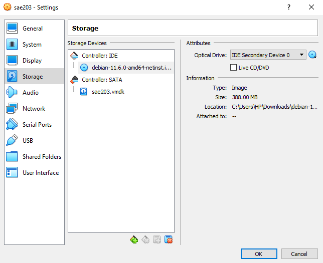
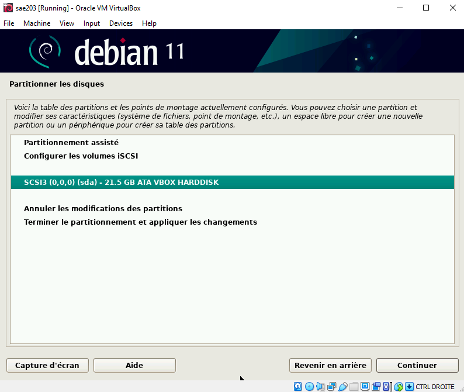
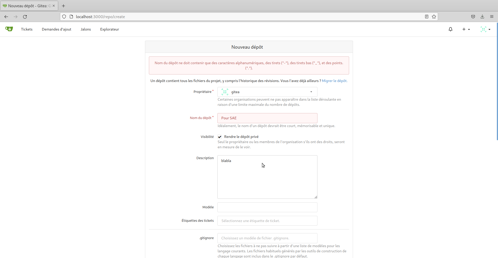

= Rapport Final
Bertout Baptiste <author>; Degey Romain <author>; Lawson Killian <author>
:toc-title: Table des matières
:toc: left
:toclevels: 5
:icons: font
:experimental:


== Semaine 07 : Balisage léger

=== I. Questions / Réponses

==== Questions 1. Configuration matérielle dans VirtualBox

=====

.Que signifie “64-bit” dans “Debian 64-bit” ?
****
Cela fait référence à la façon dont le processeur (CPU) d'un ordinateur traite les informations. Un #processeur 64 bits# traite une plus grande quantité de données qu'un #processeur 32 bits#. +
Par exemple : +
--
* Une architecture (processeur + Windows) 32 bits ne peut gerer que 3.5Go de mémoire vive inutile donc de mettre 8Go de RAM sur ce type d'architecture. +
* Une architecture (processeur + Windows) 64 bits peut gerer à partir de 3.5Go jusqu'à 128Go ou plus selon les systèmes d'exploitations et les cartes mères.  
--
****

.Quelle est la configuration réseau utilisée par défaut ?
****
Par défaut, le mode réseau choisi est #NAT#. L'avantage de ce mode, c'est que votre VM (Virtual Machine en anglais) accède à Internet, via la même connexion que l'hôte physique, sans pour autant obtenir une adresse IP sur votre réseau local.
****

.Quel est le nom du fichier XML contenant la configuration de votre machine ?
****
Le nom du fichier qui contient la confguration de la machine virtuelle est composé : [grey-background]#du nom de la machine virtuelle, suivi de l'extension ".vbox"#. Ce qui donne `<nomDeLaMachine>.vbox`. +
Prenons notre machine nommée sae203, lorsque l'on se rend dans le dossier de notre VM, nous pouvons retrouver le fichier `sae203.vbox`, qui contient donc la configuration de notre VM.
****

.Sauriez-vous modifier directement ce fichier pour mettre 2 processeurs à votre machine ? Faites-le.
****
Il faut modifier la balise ouvrante `\<CPU>` dans le fichier par   ceci `\<CPU count="2">`
Vous pouvez modifiez le fichier en utilisant un éditeur de texte lambda,
ou la commande : +

[source,bash]
----
nano \<nomDuFichier>.vbox
----
****
=====

==== Questions 2. Installation OS de base

=====

.Qu’est-ce qu’un fichier iso bootable ?
****
Les #fichiers ISO# (International Standard File) sont des fichiers images, contenant des données.
Les ISO sont généralement utilisés pour fournir les fichiers d'installation de systèmes d'exploitation (Windows, Linux). En effet, en téléchargeant un fichier ISO Windows ou Linux, vous pouvez créer un DVD-ROM ou clé USB bootable pour installer ce dernier. +

Il s’agit donc #un fichier de données# qui contient toute une arborescence de dossiers et fichiers.
Le format ISO a été créé comme moyen d’archivage des disques et en tant que tel,.
Il est devenu une méthode standard de distribution de logiciels. +

--
NOTE: La limite de taille d’un fichier ISO est 4.2 Go.
--
****


.Qu’est-ce que MATE ? GNOME ?
****
--
* Le #Bureau MATE# est une mise en œuvre d'un environnement de bureau et comprend un gestionnaire de fichiers qui peut vous connecter aux fichiers locaux et distants, un éditeur de texte, une calculatrice, un gestionnaire d'archives, un visionneur d'images et un visionneur de documents, un moniteur système et un terminal.

* Le #Bureau MATE# fournit un environnement de bureau intuitif et attractif utilisant des métaphores traditionnelles, ce qui signifie que si vous avez déjà utilisé Microsoft Windows ou macOS d’Apple, vous ne serez pas pris au dépourvu.

* #GNOME# est l'environnement de bureau utilisé par défaut dans plusieurs distributions Linux telles que Ubuntu, Fedora et Manjaro Linux.
--
C'est un environnement de bureau libre convivial dont l'objectif est de rendre accessible l'utilisation du système d'exploitation GNU au plus grand nombre
****

.Qu’est-ce qu’un serveur web ?
****
Un #serveur web# est soit un logiciel de service de ressources web, soit un serveur informatique qui répond à des requêtes du World Wide Web sur un réseau public ou privé, en utilisant principalement le protocole HTTP.
--
* Au niveau des composants matériels, #un serveur web# est un ordinateur qui stocke les fichiers qui composent un site web (par exemple les documents HTML, les images, les feuilles de style CSS, les fichiers JavaScript) et qui les envoie à l'appareil de l'utilisateur qui visite le site. Cet ordinateur est connecté à Internet et est généralement accessible via un nom de domaine tel que mozilla.org.

* Au niveau des composants logiciels, #un serveur web# contient différents fragments qui contrôlent la façon dont les utilisateurs peuvent accéder aux fichiers hébergés. On trouvera au minimum un #serveur HTTP#. Un serveur HTTP est un logiciel qui comprend les URL et le protocole HTTP (le protocole utilisé par le navigateur pour afficher les pages web).
--
****

.Qu’est-ce qu’un serveur ssh ?
****
#Shell# est à la fois un programme informatique et un protocole de communication sécurisé. Le protocole de connexion impose un échange de clés de chiffrement en début de connexion. Par la suite, tous les segments TCP sont authentifiés et chiffrés.

L'utilisation du protocole SSH va alors me permettre de me connecter à #distance# sur mes serveurs, pour les manager et disposer de toutes les possibilités d'une utilisation directe.
****

.Qu’est-ce qu’un serveur mandataire ? 
****
Un serveur mandataire ou #proxy# (de l'anglais) est un serveur informatique qui a pour fonction de relayer des requêtes entre un poste client et un serveur. Les serveurs mandataires sont notamment utilisés pour assurer les fonctions suivantes :

* mémoire cache
* la journalisation des requêtes (logging)
* la sécurité du réseau local
* le filtrage et l'anonymat.

L'utilité des serveurs mandataires est importante, notamment dans le cadre de la sécurisation des systèmes d'information.
****
=====

==== Question 3. Sudo

=====
.Comment peut-on savoir à quels groupes appartient l’utilisateur user ?
****
Pour connaître les groupes auxquels appartient un utilisateur, utilisez la commande `groups`. +
Si vous ne spécifiez pas le nom d'un utilisateur, ce sont les groupes de l'utilisateur courant qui seront affichés.
****
=====

==== Questions 4. Suppléments invités +

=====
.Quelle est la version du noyau Linux utilisé par votre VM ?
****
Avec la commande `uname -r`, il est possible d’obtenir #la version du noyau# Linux de la VM. +
Dans notre cas le noyau de notre VM est de version `5.10.0-21-amd64`.
****

.À quoi servent les suppléments invités ? Donner 2 principales raisons de les installer.
****
--
* Le #redimensionnement automatique# vous permet de redimensionner la fenêtre de la machine virtuelle, et le bureau répond automatiquement pour remplir complètement la nouvelle taille de la fenêtre. 

* Une autre fonctionnalité permettant de faciliter l'interopérabilité entre les deux systèmes d'exploitation est le glisser-déposer. Avec cela, vous pouvez simplement faire glisser des éléments d'un système d'exploitation à l'autre avec facilité.
--
****

.À quoi sert la commande mount (dans notre cas de figure et dans le cas général) ?
****
.cas général
--
La commande `mount` permet de demander au système d'exploitation de rendre un système de fichiers accessible, à un emplacement spécifié (le point de montage)
--


.cas actuel
--
La commande `mount`, dans notre cas, permet de toujours avoir les suplléments activés lors de tous redémarrage de la machine virtuelle.
--
****
=====

=== II. Rapport technique

==== Création d'une machine virtuelle
=====

****
Pour ce faire nous commencons par lancer VirtualBox et sélectionner le menu de création de nouvelle machine virtuelle.
****

.Première étape
****
Une fois cela fait nous définissons les caractéristiques de la machine notamment #le nom de la machine# (sae203), #le chemin de son dossier#, #le type de machine# (Linux), ainsi que sa #version#("Debian" en 64 bits) que vous pouvez voir ici : +

.Caractéristique 1
[#img-caracteristique1,caption="Figure 1: "]
image::images/1.PNG[Caractéristique 1,500,300]
****


.Deuxième étape
****
Puis les différentes autres caractéristiquent à configurer :

--
* La RAM (2048 Mo) : 
--

.Caractéristique 2
[#img-caracteristique2,caption="Figure 2: "]
image::images/2.PNG[caractéristique 2,500,300]

***

--
* Le type de fichier (VMDK) :
--

.Caractéristique 3
[#img-caracteristique3,caption="Figure 3: "]
image::images/3.PNG[Caractéristique 3,500,300]

***

--
* La facon dont le stockage de données est géré (taile fixe) :
--

.Caractéristique 4
[#img-caracteristique4,caption="Figure 4: "]
image::images/4.PNG[Caractéristique 4,500,300]

***

--
* La taille du disque dur virtuelle de la machine (20 GO) :
--

.Caractéristique 5
[#img-caracteristique5,caption="Figure 5: "]
image::images/5.PNG[Caractéristique 5,500,300]
****

#Et voilà notre machine virtuelle neuve.#
=====

==== Installation de l'OS

=====

.Première étape
****
Afin de faire cette installation il faut utiliser dans le lecteur cdrom de la machine nouvellement créée une iso bootable d'une installation de "Debian 11" (amd64) que l'on trouve https://www.debian.org/distrib/[*ici*]. 

.Choisir la bonne iso sur le site Debian
[#img-caracteristique6,caption="Figure 6: "]
image::images/6.PNG[caracteristique 6,500,300]
****

.Deuxième étape
****
Dans la partie stockage nous cliquons sur #l'icone de cd# là où est écrit `vide` (empty), puis apparait dans la partie de droite une autre icone de disque sur laquelle on appuie afin de choisir le fichier de disque que l'on veut.

.Accès au cdrom de notre machine
[#img-caracteristique7,caption="Figure 7: "]


.Notre iso insérée
[#img-caracteristique8,caption="Figure 8: "]

****

.Troisième étape
****
Après cette étape nous #démarrons# notre machine pour lancer l'instalation de l'OS.

.Démarage de la machine
[#img-caracteristique9,caption="Figure 9: "]
image::images/9.PNG[Caractéristique 9,500,300]
****

****
* Tout d'abord on #choisit la langue du système#, notre situation géographique ainsi que la configuration de notre clavier (ici Français puis France puis ,de nouveaux, Français).

.Choix de la langue du sytème
[#img-caracteristique10,caption="Figure 10: "]
image::images/10.PNG[Caractéristique 10,500,300]

***

.Choix de la configuration clavier
[#img-caracteristique11,caption="Figure 11: "]
image::images/11.PNG[Caractéristique 11,500,300]
****

****
* Nous choisissons #un nom pour la machine# (serveur) et #ne mettons pas# de nom de domaine.
****

****
* Il faut ensuite définir un mot de passe pour le #superutilisateur# root (le plus souvent, le mot de passe est initialisé à "root") et c'est ce que l'on a choisit.


.Choix du mot de passe superutilisateur
[#img-caracteristique12,caption="Figure 12: "]
image::images/12.PNG[caracteristique 12,500,300]
****

****
* Nous définissons ensuite un #utilisateur# avec son nom complet (User) son identifiant (user) et son mot de passe (user).

.Choix du mot de passe utilisateur
[#img-caracteristique13,caption="Figure 13: "]
image::images/13.PNG[caracteristique 13,500,300]
****

****
* La configuration du partionnement des disques est quelque peu délicate, il faut :
** Manuellement choisir de créer une partition
** Sélectionner le disque dur
** Cocher `oui`
** Selectionner l'espace libre
** Créer une nouvelle partition
** Laisser la taille maximale du disque
** Selectionner primaire
** Enfin il faut sélectionner pour le point de montage le système de fichier racine
****

****
* Terminer finalement le partitionnement :

.Choix de la partition manuellement
[#img-caracteristique14,caption="Figure 14: "]
image::images/14.PNG[caracteristique 14,500,300]

***

.Sélection du disque dur
[#img-caracteristique15,caption="Figure 15: "]


***

.Sélection de l'espace libre
[#img-caracteristique16,caption="Figure 16: "]
image::images/16.PNG[caracteristique 16,500,300]

***

.Sélection du point de montage
[#img-caracteristique17,caption="Figure 17: "]
image::images/17.PNG[caracteristique 17,500,300]

***

.Sélection pays du miroir
[#img-caracteristique18,caption="Figure 18: "]

****

****
* Ici nous devons choisir un miroir d'ou proviendra les paquets, on prends le miroir `http://debian.polytech-lille.fr/` dans les miroirs se trouvant en France :

.Sélection du miroir
[#img-caracteristique19,caption="Figure 19: "]
image::images/19.PNG[caracteristique 19,500,300]
****

****
* Nous trouvant à l'IUT nous devons utiliser un proxy `http://cache.univ-lille.fr:3128/` qui ne serait pas nécessaire en effectuant l'installation chez nous :

.Renseignement du proxy
[#img-caracteristique20,caption="Figure 20: "]
image::images/20.PNG[caracteristique 20,500,300]
****

****
* Dans notre cas d'utilisation nous n'avons pas d'intérêt à activé l'envoi automatique des statistiques sur les paquets que nous utilisons.
****

****
* Notre sélection des logiciels de démarrage sont ceux cochées ci-dessous :
.Sélection des logiciels de démarrage
[#img-caracteristique21,caption="Figure 21: "]
image::images/21.PNG[,500,300]
****

****
* Pour finir nous installons le système de démarage GRUB sur le seul disque que nous avons.
****

#Et voilà notre installation de l'OS terminer.#

****
TIP: _Nous faisons évidemment attention à bien retirer l'iso du cdrom avant de relancer notre machine après avoir achevé l'installation_ (ici le cdrom a été vidé automatiquement à la fin de l'installation).

.Cdrom vide
[#img-caracteristique22,caption="Figure 22: "]
image::images/22.PNG[caracteristique 22,500,300]
****
=====

==== Donner l'accès sudo à l'utilisateur

=====
*Passons à la partie suivante.*

****
Ceci simplifie par la suite notre utilisation de la machine mais il est préférable au niveau sécuritaire de n'utiliser que le superutilisateur (root) qui sans l'accès à celui-ci restraint l'accès à la configuration de la machine.
****

[.underline]#Voici les étapes que nous devons effectuée afin de donner l'accès sudo à l'utilisateur :#

****
* Tout d'abord nous devons passer en mode console de la machine virtuelle, seulement un problème s'oppose à nous, si nous ouvrons la consôle elle s'ouvre sur la machine physique et non sur la machine virtuelle, nous devons donc, pour éviter cela, aller au niveau du menu en haut de Virtualbox dans `Entrées › Clavier` et selectionné : `Clavier virtuel`.

.Activation du clavier virtuel
[#img-caracteristique23,caption="Figure 23: "]
image::images/23.PNG[caracteristique 23,500,300]
****

****
* Suite à cela, on utilise la combinaison de touches : kbd:[Ctrl+T+F1]  sur le clavier virtuel ce qui ouvre le terminal.

.Mode console
[#img-caracteristique24,caption="Figure 24: "]
image::images/24.PNG[caracteristique 24,500,300]
****

****
* #Nous nous connectons en root# grace à l'identifiant "root" et le mot de passe que l'on a initialisé dans l'étape :  *2. installation de l'OS*.
****

****
* Pour finir, on ajoute l'utilisateur au groupe sudo à l'aide de la commande :

[source,bash]
----
sudo adduser <NomUtilisateur> sudo
----

IMPORTANT: *A noter que les "<" et ">" présents dans les lignes de commande nous indiquent seulement que la partie entre guillemets est à modifié selon ce qui correspond sur notre machine*.
****

****
* Nous verifions que la modification a été effectuée avec la commande :

[source,bash]
----
groups <NomUtilisateur>
----
****

=====

==== Installer des suppléments invités

=====

Dans cette partie nous avons ajouté des suppléments invités, pour ce faire :

****
* Nous sommes allé au niveau du menu en haut de Virtualbox dans `Périphériques › Insérer l’image CD des additions invités…` .
****

****
* Puis pour monter le cd, nous avons utilisé la commande :

[source,bash]
----
sudo mount /dev/cdrom /mnt
----
****

****
* Finalement pour installer les suppléments nous avons effectué la commande :

[source,bash]
----
sudo /mnt/VBoxLinuxAdditions.run
----

.Ligne de commandes entrées dans la console
[#img-caracteristique25,caption="Figure 25: "]

****

****
Après redémarrage de la machine et reconnexion nous pouvons constater le fonctionnement des suppléments après avoir mis la fenêtre en grand.
****
=====


==== Configurer le proxy
=====
Normalement le proxy a déjà été configurer dans la partie *2. installation de l'OS*.
Mais si il nous venez à l'idée d'utiliser un autre proxy nous pouvons le configurer de deux manières : + 

.Première façon : changer le proxy dans le fichier de configuration.
****

Il nous faut d'abord accéder à ce fichier.
Pour cela il nous faut ouvrir un terminal, et utiliser la commande suivante :

[source,bash]
----
nano $HOME/.bashrc
----

Nous voila dans le fichier de configuration.
#On descend# maintenant tout en bas de ce fichier et on insert les lignes suivantes :

[source,bash]
----
export http_proxy=<ProxyQueVousVoulezUtiliser>
export https_proxy=$http_proxy
----

Il ne nous reste plus qu'à enregistrer et à quitter l'éditeur. Pour cela il faut utiliser la combinaison de touche suivante : +

* D'abord kbd:[Ctrl+O] puis `entrer` ce qui nous permet #d'enregistrer#. + 

* Et enfin kbd:[Ctrl+X] ce qui nous permet de #sortir# de l'éditeur.
****

.Deuxième façon : version graphique
****

On peut procéder directement en version "graphique". +
C'est à dire que l'on peut modifier le proxy via les paramètre direct. +
Pour cela il nous faut nous rendre dans : +
`Système › Préférences › Internet et réseau ›
Serveur mandataire`. +
De la nous avons juste à placer le même proxy dans la zone http et dans la zone http sécurisé.

Si toute fois nous voulons désactiver le proxy il nous suffi de cocher l’option `Connexion directe à Internet` au même endroit.
****
=====

.FIN
****
**Et voila, notre machine virtuelle est configurée.**
****

==  Semaine 09 : Installation Debian automatisée par préconfiguration

=== I. À propos de la distribution Debian

==== Questions 1 
====

****
.Qu’est-ce que le Projet Debian ?
--

Le projet Debian est un groupe mondial de volontaires qui s'efforcent de produire un système d'exploitation qui soit composé exclusivement de logiciels libres. Le principal produit de ce projet est la distribution Debian GNU/Linux, qui inclut le noyau Linux ainsi que des milliers d'applications pré-empaquetées.
--

.D’où vient le nom Debian ?
--
Le nom Debian tire son origine des prénoms du créateur de Debian, Ian Murdock, et de son épouse, Debra.
--

NOTE: Source : https://www.debian.org/doc/manuals/project-history/project-history.fr.pdf[*Debian.org*]
****
====

==== Questions 2 
====

.Il existe 3 durées de prise en charge (support) de ces versions et quelles sont les durées de ces prises en charge ?
****

 
.la durée minimale
--
La date de fin de prise en charge pour la version stable est la date de publication de la version stable suivante plus un an. Par exemple, Debian Bullseye (« Buster +1 ») a été publiée le 14 août 2021, donc la fin de prise en charge de Debian Buster est en août 2022.
--
 
.la durée en support long terme (LTS) 
--
Debian Long Term Support (LTS), pour prise en charge à long terme, est un projet pour étendre la durée de vie de toutes les versions stables de Debian à (au moins) 5 ans. Debian LTS n'est pas gérée par l'équipe chargée de la sécurité de Debian, mais par un groupe distinct de bénévoles et sociétés intéressées pour en faire un succès. Ainsi, l'équipe Debian LTS prendra en charge les mises à jour de sécurité des différentes versions une fois que l'équipe en charge de la sécurité aura terminé son travail. 
--
 
.la durée en support long terme étendue (ELTS)
--
La prise en charge à long terme étendue (ELTS) est une offre commerciale offrant un prolongement de la durée de vie de 10 ans des versions de Debian (c'est-à-dire de 5 ans après la prise en charge de 5 ans offerte par le projet LTS). Il ne s'agit pas d'un projet officiel de Debian. L'infrastructure de Debian, et les autres ressources de Debian ne sont pas impliquées. 
--

Source : https://www.debian.org/releases/[*Debian.org*] et son https://wiki.debian.org/fr/LTS[*wikipédia*]
****
====

==== Questions 3 
====

.Pendant combien de temps les mises à jour de sécurité seront-elles fournies ?
****

L'équipe Debian LTS prend en charge les mises à jour de sécurité des différentes versions une fois que l'équipe chargée de la sécurité aura terminé son travail. 
Autrement dit, les mises à jour de sécurité seront fournies durant toute la durée du LTS.

Source : https://wiki.debian.org/fr/LTS[*Wikipédia de Débian*]
****
====

==== Questions 4 
====

.Combien de versions au minimum sont activement maintenues par Debian ? Donnez leur nom générique (= les types de distribution).
****

Il reste deux versions activement maintenues par Debian sont  : +
- Debian 11 (“Bullseye”) +
- Debian 10 (“Buster”)

Source : https://www.debian.org/releases/index.fr.html#:~:text=Actuellement%2C%20la%20distribution%20stable%20de,publiée%20le%2017%20décembre%202022[*Debian.org*]
****
====

==== Questions 5 
====

.Chaque distribution majeure possède un nom de code différent. D’où viennent les noms de code données aux distributions ?
****
Jusqu'ici les noms de code proviennent des personnages des films « Toy Story » par Pixar. 

Source : https://www.debian.org/doc/manuals/project-history/project-history.fr.pdf[*Debian.org*]
****
====

==== Questions 6 
====

.L’un des atouts de Debian fut le nombre d’architecture (≈ processeurs) officiellement prises en charge. Combien et lesquelles sont prises en charge par la version Bullseye ?
****
Debian GNU/Linux 11 fonctionne sur 9 architectures principales et sur de nombreuses variantes de celles-ci, appelées « saveurs ». +

.On compte parmis ces saveurs :
--
- amd64 +
- i386 +
- armel +
- armhf +
- arm64 +
- mips64el +
- mipsel +
- ppc64el +
- s390x
--

Source : https://www.debian.org/releases/stable/armel/ch02s01.fr.html[*Debian.org*]
****
====

==== Questions 7 
====

.Première version avec un nom de code
****
.Quel a été le premier nom de code utilisé ?
--
Le tout premier nom de code utilisé fut Buzz (le cosmonaute Buzz l’éclair)

--

.Quand a-t-il été annoncé ?
--
Cette première version est sortie en juin 1996
--

.Quel était le numéro de version de cette distribution ?
--
Le numéro de version était Debian 1.1
--

Source : https://www.debian.org/doc/manuals/project-history/project-history.fr.pdf[*Debian.org*] -> page 9 ligne 23 : “Debian 1.1 Buzz”
****
====

==== Questions 8 
====

.Dernier nom de code attribué
****
.Quel est le dernier nom de code annoncé à ce jour ?
--
Forky
--

.Quand a-t-il été annoncé ?
--
Il a été annoncé le 13 Octobre 2022
--

.Quelle est la version de cette distribution ?
--
Debian 14
--
****
====

=== II. Installation préconfigurée

==== Première étape
====

.Création de la machine virtuelle
****
Pour cette première étape, nous avons recréé une machine virtuelle de la même manière que dans le premier rapport que l'on peut retrouver link:#_création_dune_machine_virtuelle[*ici*]
****
====

==== Deuxième étape
====

.Téléchargement de l'archive
****
Pour cette deuxième étape nous avons télécharger l'archive autoinstall.zip. +
Cette archive comprant les fichiers suivants: +
--
.isolinux-isolinux.cfg
.isolinux-txt-fr.cfg
.preseed-fr.cfg
.S203-Debian11.viso
.vboxpostinstall.sh
--

Pour finir cette étape nous avons décompressé dans le dossier de la machine virtuelle.
****
====

==== Troisième étape
====

.Modification du fichier .viso et insertion
****
Une fois la décompression effectuée, nous avons  modifié la chaine `@@UUID@@` 
par un identifiant unique universel via la ligne de commande :  +

[source,ruby]
----
sed -i -E "s/(--iprt-iso-maker-file-marker-bourne-sh).*$/\1=$(cat /proc/sys/kernel/random/uuid)/" S203-Debian11.viso
----

.Modification du fichier .viso
[#img-modification,caption="Figure 26: "]
image::images/26.png[Modification du fichier .iso,650,450]

***

Puis nous insérons ce fichier dans l'emplacement cdrom comme le montre link:file:///C:/Users/bapti/Documents/cours/BUT_s2/S2.03/rapport_semaine_06/Rapport.html#_2_installation_de_los[*cette partie*]

.Insertion du fichier .viso
[#img-insertion,caption="Figure 27: "]

****
====

==== Quatrième étape
====

.Démarrage de la machine
****
Nous avons démarré la machine et nous avons attendu que l'installation se termine et que la machine se reboot.
Après avoir vérifié si cela avait fonctionné, le changement de taille ne s'est malheureusement pas appliqué. +
****
====

==== Cinquième étape
====

.Droit sudo
****
Pour faire une installation avec plus d’options nous modifions le fichier `preseed-fr.cfg` avant l’ajout du .viso.

Pour donner le droit sudo à l’utilisateur, il faut l’ajouter par défaut dans le groupe sudo, nous avons donc modifier cette ligne : +
`d-i passwd/user-default-groups string audio cdrom video` +
par : +
`d-i passwd/user-default-groups string audio cdrom video sudo`

.Droit sudo
[#img-droit_sudo,caption="Figure 28: "]

****
====

==== Sixième étape
====
.Installation de l'environnement MATE
****
Pour avoir un aspect graphique, il faut modifier les lignes dans le fichier preseed-fr.cfg :

--
* `tasksel tasksel/first multiselect standard ssh-server `
--

.On ajoute l'environnement #MATE# par cette ligne : 
--
* `tasksel tasksel/first multiselect standard ssh-server mate-desktop`
--

.Ajout de l'environnement MATE
[#img-environnement_mate,caption="Figure 29: "]
image::images/30.png[Ajouter l'environnement MATE,650,450]

Nous avons trouver dans la documentation un passage qui nous a permi de comprendre ce que nous pouvions faire : +

.Documentation
--
.Modification du fichier .viso
[#img-documentation,caption="Figure 30: "]


Source : link:https://www.debian.org/releases/stable/i386/apbs04.en.html[*debian.org*] section : B.4.10. Package selection
--
****
====

==== Septième étape
====
.Installation des paquets
****
Pour l'installation des paquets, nous utilisons la commande de la forme suivante :
--
* `d-i pkgsel/include string <paquet>`
--

Pour installer les paquets que nous voulons : 
--
* `d-i pkgsel/include string sudo git sqlite3 curl bash-completion neofetch`
--

.Installation des paquets
[#img-installation_paquets,caption="Figure 31: "]
image::images/30_bis.png[Installation des paquets,650,450]

--
If you want to install some individual packages in addition to packages installed by tasks, you can use the parameter pkgsel/include. The value of this parameter can be a list of packages separated by either commas or spaces, which allows it to be used easily on the kernel command line as well. 

Source : link:https://www.debian.org/releases/stable/i386/apbs04.en.html[*debian.org*] section : B.4.10. Package selection
--
****
====

==== Dernière étape
====
.Vérification
****
Pour vérifier les ajouts par l’installation automatique après la modification précédente nous faisons `groups user` afin de voir si `user` est bien dans sudo, nous constatons aussi une interface graphique debian.

.Vérification
[#img-verification,caption="Figure 32: "]
image::images/31.png[Vérification de la modification,650,450]
****
====


==  Semaine 10 et 11 : Gitea

=== I. Réponse aux questions : 

==== Question 1 

====

****
.Qu’est-ce que le logiciel git-gui ? Comment se lance-t-il ?
--
gti-gui est l’interface graphique d'un outil en ligne de commande (en somme un 
logiciel). De ce fait, toutes les possibilités offertes par Git ne sont pas disponibles 
dans Git Gui. Il est tout de même possible de procéder à des changements à leur 
dépôts en créant de nouveaux commits, les modifiants, créer de nouvelles branches, 
procéder à des fusions etc. +

Pour lancer Git gui, il y a plusieurs possibilités. Soit en ligne de commande: +

```bash
git gui
```

Soit, sous Windows via le menu démarrer ou le menu contextuel du clic droit dans un dossier.

Source : https://git-scm.com/docs/git-gui/[*git-scm.com*]
--
****

****
.Mêmes questions avec gitk
--
Gitk est un logiciel permettant l'affichage des changements dans un dépot ou une 
sélection de commits, en partie il affiche le graphe des commits, les informations à 
propos de chaque commit et les fichiers. +
Pour le lancer Gitk on tape en ligne de commande : +
```bash
gitk
```

Source : https://git-scm.com/docs/gitk[*git-scm.com*]
--
****

****
.Quelle sera la ligne de commande git pour utiliser par défaut le proxy de l’université sur tous vos projets git ?
--
```bash
git config --global http.proxy http://cache.univ-lille.fr:3128
```

Source : https://stackoverflow.com/questions/783811/getting-git-to-work-with-a-proxy-server-fails-with-request-timed-out[*stackoverflow.com*]
--
****
====

==== Question 2

====

****
.Qu’est-ce que Gitea ?
--
* Gitea est une forge logicielle libre en Go sous licence MIT, pour l'hébergement de développement logiciel, basé sur le logiciel de gestion de versions Git pour la gestion du code source, comportant un système de suivi des bugs, un wiki, ainsi que des outils pour la relecture de code. (Source : https://fr.wikipedia.org/wiki/Gitea[*wikipedia.org*])

* Gitea est un service Git auto-hébergé très simple à installer et à utiliser. Il est similaire à GitHub, Bitbucket ou Gitlab. (Source : https://docs.gitea.io/fr-fr/[*gitea.io*])

* Gitea est une forge logicielle web écrite en Go (Golang), il permet entre autres de fournir une interface web pour gérer vos différents dépôts (Source : https://nyleza.com/blog/decouverte-et-installation-gitea-gestionnaire-repo-git/[*nyleza.com*])
--
****

****
.À quels logiciels bien connus dans ce domaine peut-on le comparer ?
--
Gitea peut être comparé à link:https://about.gitlab.com/fr-fr/[*Gitlab*] ou encore link:https://github.com/[*GitHub*]

Source : link:https://www.google.com/search?rlz=1C1GCEA_enFR1015FR1015&sxsrf=APwXEdegHKtfnxDdahgh2VR0ABWScRxN8w:1679841535961&q=Gitea&stick=H4sIAAAAAAAAAONgFuLVT9c3NEzLMzVKTq_KVkLlagkGZ6aklidWFvulVpQEl6QWFC9iZXXPLElN3MHKCAAfnXlzPgAAAA&sa=X&ved=2ahUKEwjTl56w6fn9AhWWVaQEHSKaBI4QMSgAegQIWxAB&biw=1536&bih=714&dpr=1.25[*Recherche google*]
--
****
====

==== Question 3

====

****
.Comment faire pour la mettre à jour sans devoir tout reconfigurer ? Essayez en mettant à jour vers la version 1.19.
--
Vous pouvez mettre à jour vers une nouvelle version de Gitea en arrêtant Gitea, en remplaçant le binaire dans `/usr/local/bin/gitea` et en redémarrant l'instance. +

Le nom du fichier binaire ne doit pas être modifié pendant la mise à jour pour éviter des problèmes dans les référentiels existants. +

Il est recommandé de faire une https://docs.gitea.io/en-us/backup-and-restore/[*sauvegarde*] avant de mettre à jour votre installation.

IMPORTANT: Si vous avez effectué les étapes d'installation décrites ci-dessus, le binaire doit avoir le nom générique gitea. Ne le modifiez pas, comme pour inclure le numéro de version par exemple.
--
****
====

==== Question 4

====
****
.Que se passe-t-il ? Qu’elle semble en être la cause ?
--
//TODO: repondre
--
****
====

=== II. Installation de Gitea

==== Préliminaire

=====  Configuration globale de git

====
****
Nous avons configurer quelques paramètres pour le logiciel git sur votre compte utilisateur.

Pour ce faire nous avons, dans un terminal, entré ces commandes : 

* `git config --global user.name "Romain Degez"`

* `git config --global user.email "romain.degez.etu@univ-lille.fr"`

* `git config --global init.defaultBranch "master"`

.Configuration globale de git
[#img-configuration,caption="Figure 32: "]
image::images/32.png[Configuration globale de git,650,450]
****

****
Afin d’installer le paquet git-gui nous utilissons la commande :
```bash
sudo apt-get install git-gui
```

.Installation du paquet
[#img-installation_paquet,caption="Figure 33: "]
image::images/33.png[Installation du paquet,650,450]

.Configuration globale de git
[#img-installation_paquet_2,caption="Figure 34: "]
image::images/34.png[Configuration globale de git,650,450]
****
====

=====  Accéder au port 3000

====
****
Nous avons besoin de rediriger le port 3000 de la machine physique, pour ce faire on peut entrer une commande dans le terminal ou bien le faire via l’interface graphique de virtualbox  :
****

.Ajouter en ligne de commande
****
```bash
VBoxManage modifyvm "sae203b" --natpf1 "gitea,tcp,,3000,,3000"
```

.Redirection du port 3000
[#img-vboxmanage,caption="Figure 37: "]
image::images/37.png[Redirection du port 3000,650,450]

****

.Ajouter via interface
****
* Nous sommes allé dans configuration de la machine sae203b
* Puis dans réseau
* Puis nous avons cliqué sur `redirection de ports`

.Redirection du port 3000 via l'interface
[#img-interface,caption="Figure 38: "]
image::images/35.png[Redirection du port 3000 via l'interface,650,450]

* Puis nous l'avons ajouté à l'aide du petit `+` comme sur l’image

.Ajout de la redirection
[#img-interface-2,caption="Figure 39: "]
image::images/36.png[Redirection du port 3000 via l'interface,650,450]

Source : https://www.virtualbox.org/manual/UserManual.html#natforward[*virtualbox.org*]
****
====

==== Installation de Gitea

===== Installation du binaire

====
****
Tout d’abord nous avons définit par défaut le proxy de l'université dans notre bash, pour ce faire nous ajoutons dans le `.bashrc` les lignes suivantes à la fois connecté en root et à la fois en user : +

```bash
export http_proxy=http://cache.univ-lille.fr:3128
export https_proxy=http://cache.univ-lille.fr:3128
```

.export
[#img-export,caption="Figure 40: "]
image::images/40.png[Modification du fichier .bashrc,650,450]

Apèes avoir fait ça, on redémarre la machine pour appliquer le proxy par défaut

****

****
Il n’y a pas de paquets debian disponible pour le logiciel gitea, donc il faut pour cela l’installer d’une façon différente. +
Nous avons pour cela fait une installation du binaire dont la démarche est expliqué link:https://docs.gitea.io/en-us/install-from-binary/[*ici*] : 

* Tout d’abord nous allons télécharger Gitea via le ficher “gitea-1.18.5-linux-amd64” se trouvant dans le dossier de la version 1.18.5 du binaire précompilé (pour linux donc linux-amd64). 

.1.18.5
[#img-gitea_1_18_5,caption="Figure 41: "]


***

.1.18.5_bis
[#img-gitea_1_18_5_bis,caption="Figure 42: "]


* Pour le faire simplememnt, nous avons utiliser les commande : +
```bash
wget -O gitea https://dl.gitea.com/gitea/1.18.5/gitea-1.18.5-linux-amd64
chmod +x gitea
```

.wget
[#img-wget,caption="Figure 43: "]
image::images/41.png[Téléchargement du fichier Gitea,650,450]

* Il faut ensuite valider le binaire téléchargé utilisant la clé correspondante (gitea-1.18.5-linux-amd64.asc) via les commande : +
```bash
gpg --keyserver keys.openpgp.org --recv 7C9E68152594688862D62AF62D9AE806EC1592E2
gpg --verify gitea-1.18.5-linux-amd64.asc gitea-1.18.5-linux-amd64
```

.gpg
[#img-gpg,caption="Figure 44: "]
 

IMPORTANT: La vérification n'a pas fonctionnée à cause du serveur qui est down, on peut voir que la commande moulline sans que rien ne se passe, donc on a passé la vérification.

* On vérifie ensuite la version de git, celle ci doit être supérieur à 2.0 : +
```bash
git  - - version
```
Ce qui affiche : git version 2.30.2

* On crée ensuite un utilisateur pour lancer Gitea : +
```bash
adduser \
   --system \
   --shell /bin/bash \
   --gecos 'Git Version Control' \
   --group \
   --disabled-password \
   --home /home/git \
   git
```

.adduser
[#img-adduser,caption="Figure 45: "]
image::images/43.png[Création d'un utilisateur,650,450]

* On crée l'arborescence utile pour Gitea avec un ensemble de commande : +
```bash
mkdir -p /var/lib/gitea/{custom,data,log}
chown -R git:git /var/lib/gitea/
chmod -R 750 /var/lib/gitea/
mkdir /etc/gitea
chown root:git /etc/gitea
chmod 770 /etc/gitea
```

NOTE: On donne des droits d’écriture temporaire pour l’utilisateur git sur le fichier `/etc/gitea`. 

Après l'installation, il vaut mieux remettre les permissions de ce fichier en lecture seulement : +
```bash
chmod 750 /etc/gitea
chmod 640 /etc/gitea/app.ini
```

IMPORTANT: Nous avons un problème ici, impossible d’avoir accès au fichiers `app.ini`. Il n’est pas trouvable sur la machine.

* On configure l’espace de travail Gitea : +

NOTE: Si on avait envisagé de ne pas exécuter Gitea en tant que service Linux, on aurait dû exécuter cette commande pour définir cette variable d'environnement de manière (semi-)permanente afin que Gitea utilise systématiquement le bon répertoire de travail : `export GITEA_WORK_DIR=/var/lib/gitea/`

* On copie le binaire de Gitea dans un emplacement global : +
```bash
cp gitea /usr/local/bin/gitea
```

****
====

===== Démarrage automatique du service

====
****
On crée un fichier service pour l’automatisation du lancement de Gitea : +

* Pour ce faire nous utilisons la commande : +
```bash
nano /etc/systemd/system/gitea.service
```
qui nous permet de copier directement dans ce nouveau fichier.

* Nous y insérons l'ensemble du contenu de link:https://github.com/go-gitea/gitea/blob/main/contrib/systemd/gitea.service[*cette page*]

* Pour finir nous lançons gitea avec ces commandes : +
```bash
sudo systemctl enable gitea
sudo systemctl start gitea
```

****
====

===== Paramétrage de Gitea

====
****
Pour cette partie nous avons tout d’abord vérifié si la redirection du port 3000 fonctionne en utilisant la commande : 

```bash
systemctl status gitea.service
```

Cela nous affiche active (running) ce qui signifie que cela fonctionne bel et bien

.Affichage de la redirection
[#img-affichage,caption="Figure 46: "]

****

****
Ensuite nous paramétrons le service gitea via notre navigateur, pour ce faire nous nous rendons sur le navigateur de notre machine physique à cette url : http://localhost:3000/

.Paramétrage de gitea
[#img-configuration_gitea,caption="Figure 47: "]
image::images/45.png[Paramétrage de Gitea,650,450]

Nous avons modifier le paramétrage de Gitea sur notre navigateur : +

* Nous changeons la base de données qui sera maintenant SQLite3
* Nous avons laissé tout le reste par défaut jusqu'à la partie “Paramètres facultatifs”
* Dans cette partie nous avons modifié la partie “Paramètre de compte administrateur” :
** le nom devient : gitea
** le mot de passe : gitea
** l’email devient : git@localhost

.Modification de gitea
[#img-modification_gitea,caption="Figure 48: "]

****

****
IMPORTANT: Lors de la validation du paramétrage de l'installation une erreur est survenue car nous n’avions plus l'accès à `/etc/gitea/app.ini`

.Erreur sur gitea
[#img-erreur_gitea,caption="Figure 49: "]
image::images/47.png[Erreur sur gitea,650,450]

Nous avons donc donné de nouveau l'accès : 

```bash
chmod 770 /etc/gitea
chmod 770 /etc/gitea/app.ini
```

Puis avons valider l’installation de gitea

Nous avons finalement protéger de nouveaux les fichiers `/etc/gitea` et `/etc/gitea/app.ini` avec les commandes : 

```bash
chmod 750 /etc/gitea
chmod 640 /etc/gitea/app.ini
```

****
====

==== Utilisation basique

====
****
Nous avons créé un dépot via l’interface gitea :

.Dépot sur gitea
[#img-depot_gitea,caption="Figure 50: "]
image::images/48.png[Dépot sur gitea,650,450]

Nous avons eu un problème lors de l'initialisation du nom qui ne peut pas comporter d’espaces (voir image)

.Création d'un dépot gitea
[#img-nouveau_depot,caption="Figure 51: "]
image::images/50.png[Création d'un dépot gitea,650,450]

.Erreur à la création du dépot
[#img-erreur_depot,caption="Figure 52: "]


Le dépot est créé

.Dépot créé
[#img-depot_crée,caption="Figure 53: "]
image::images/52.png[Dépot créé,650,450]

***

.Migration des données
[#img-migration_données,caption="Figure 54: "]
image::images/54.png[Migration des données sur Gitea,650,450]

***

.Migrer depuis Gitlab
[#img-gitlab,caption="Figure 55: "]
image::images/55.png[Migration des données depuis Gitlab,650,450]

***

.Nouveau dépot pour dev-oo
[#img-depot_dev-oo,caption="Figure 56: "]

****
====

== Problème majeur de ce projet

====
Nous avons dù refaire la VM plein de fois, puis on a découvert cette commande nous permettant d’éviter cela et d'avoir accès à nos machine en dehors de nos salle de TP : 

Se connecter à la machine : 
```bash
ssh -X [login@] ayou09
```

Nous n'avons pas réussi à trouver un moyen plus "propre" d'injecter du CSS au rapport html que par cette façon ci-dessous : +

```html
<link rel="stylesheet" type="text/css" href="css/override.css">
```
Et en entourant cette ligne par les caractères '++++' pour permettre au compilateur d'injecter cette ligne en tant que lien vers le fichier override.css.

Cette ligne disparait dans le rapport html mais ne disparait malheureusement pas dans le rapport pdf.


//Ligne permettant d'injecter dans le rapport html un lien vers le fichier overrride.css permettant l'ajout d'un fichier css personalisé
++++
<link rel="stylesheet" type="text/css" href="css/override.css">
++++

====