= Rapport N°1
Bertout Baptiste <author>; Degey Romain <author>; Lawson Killian <author>
:toc-title: Table des matières
:toc: left
:icons: font
:experimental:
// :stylesheet: css/override.css

== I. Questions / Réponses

=== Questions 1. Configuration matérielle dans VirtualBox

====

.Que signifie “64-bit” dans “Debian 64-bit” ?
****
Cela fait référence à la façon dont le processeur (CPU) d'un ordinateur traite les informations. Un #processeur 64 bits# traite une plus grande quantité de données qu'un #processeur 32 bits#. +
Par exemple : +
> Une architecture (processeur + Windows) 32 bits ne peut gerer que 3.5Go de mémoire vive inutile donc de mettre 8Go de RAM sur ce type d'architecture. +
> Une architecture (processeur + Windows) 64 bits peut gerer à partir de 3.5Go jusqu'à 128Go ou plus selon les systèmes d'exploitations et les cartes mères.  
****

.Quelle est la configuration réseau utilisée par défaut ?
****
Par défaut, le mode réseau choisi est #NAT#. L'avantage de ce mode, c'est que votre VM (Virtual Machine en anglais) accède à Internet, via la même connexion que l'hôte physique, sans pour autant obtenir une adresse IP sur votre réseau local.
****

.Quel est le nom du fichier XML contenant la configuration de votre machine ?
****
Le nom du fichier qui contient la confguration de la machine virtuelle est composé : [grey-background]#du nom de la machine virtuelle, suivi de l'extension ".vbox"#. Ce qui donne `<nomDeLaMachine>.vbox`. +
Prenons notre machine nommée sae203, lorsque l'on se rend dans le dossier de notre VM, nous pouvons retrouver le fichier `sae203.vbox`, qui contient donc la configuration de notre VM.
****

.Sauriez-vous modifier directement ce fichier pour mettre 2 processeurs à votre machine ? Faites-le.
****
Il faut modifier la balise ouvrante `\<CPU>` dans le fichier par   ceci `\<CPU count="2">`
Vous pouvez modifiez le fichier en utilisant un éditeur de texte lambda,
ou la commande : +

[source,bash]
----
nano \<nomDuFichier>.vbox
----
****
====

=== Questions 2. Installation OS de base

====

.Qu’est-ce qu’un fichier iso bootable ?
****
Les #fichiers ISO# (International Standard File) sont des fichiers images, contenant des données.
Les ISO sont généralement utilisés pour fournir les fichiers d'installation de systèmes d'exploitation (Windows, Linux). En effet, en téléchargeant un fichier ISO Windows ou Linux, vous pouvez créer un DVD-ROM ou clé USB bootable pour installer ce dernier. +

Il s’agit donc #un fichier de données# qui contient toute une arborescence de dossiers et fichiers.
Le format ISO a été créé comme moyen d’archivage des disques et en tant que tel,.
Il est devenu une méthode standard de distribution de logiciels. +

--
NOTE: La limite de taille d’un fichier ISO est 4.2 Go.
--
****

.Qu’est-ce que MATE ? GNOME ?
****
> Le #Bureau MATE# est une mise en œuvre d'un environnement de bureau et comprend un gestionnaire de fichiers qui peut vous connecter aux fichiers locaux et distants, un éditeur de texte, une calculatrice, un gestionnaire d'archives, un visionneur d'images et un visionneur de documents, un moniteur système et un terminal.

> Le #Bureau MATE# fournit un environnement de bureau intuitif et attractif utilisant des métaphores traditionnelles, ce qui signifie que si vous avez déjà utilisé Microsoft Windows ou macOS d’Apple, vous ne serez pas pris au dépourvu.

> #GNOME# est l'environnement de bureau utilisé par défaut dans plusieurs distributions Linux telles que Ubuntu, Fedora et Manjaro Linux.
C'est un environnement de bureau libre convivial dont l'objectif est de rendre accessible l'utilisation du système d'exploitation GNU au plus grand nombre
****

.Qu’est-ce qu’un serveur web ?
****
Un #serveur web# est soit un logiciel de service de ressources web, soit un serveur informatique qui répond à des requêtes du World Wide Web sur un réseau public ou privé, en utilisant principalement le protocole HTTP.

> Au niveau des composants matériels, #un serveur web# est un ordinateur qui stocke les fichiers qui composent un site web (par exemple les documents HTML, les images, les feuilles de style CSS, les fichiers JavaScript) et qui les envoie à l'appareil de l'utilisateur qui visite le site. Cet ordinateur est connecté à Internet et est généralement accessible via un nom de domaine tel que mozilla.org.

> Au niveau des composants logiciels, #un serveur web# contient différents fragments qui contrôlent la façon dont les utilisateurs peuvent accéder aux fichiers hébergés. On trouvera au minimum un #serveur HTTP#. Un serveur HTTP est un logiciel qui comprend les URL et le protocole HTTP (le protocole utilisé par le navigateur pour afficher les pages web).
****

.Qu’est-ce qu’un serveur ssh ?
****
#Shell# est à la fois un programme informatique et un protocole de communication sécurisé. Le protocole de connexion impose un échange de clés de chiffrement en début de connexion. Par la suite, tous les segments TCP sont authentifiés et chiffrés.

L'utilisation du protocole SSH va alors me permettre de me connecter à #distance# sur mes serveurs, pour les manager et disposer de toutes les possibilités d'une utilisation directe.
****

.Qu’est-ce qu’un serveur mandataire ? 
****
Un serveur mandataire ou #proxy# (de l'anglais) est un serveur informatique qui a pour fonction de relayer des requêtes entre un poste client et un serveur. Les serveurs mandataires sont notamment utilisés pour assurer les fonctions suivantes :

* mémoire cache
* la journalisation des requêtes (logging)
* la sécurité du réseau local
* le filtrage et l'anonymat.

L'utilité des serveurs mandataires est importante, notamment dans le cadre de la sécurisation des systèmes d'information.
****
====

=== Question 3. Sudo

====
.Comment peut-on savoir à quels groupes appartient l’utilisateur user ?
****
Pour connaître les groupes auxquels appartient un utilisateur, utilisez la commande `groups`. +
Si vous ne spécifiez pas le nom d'un utilisateur, ce sont les groupes de l'utilisateur courant qui seront affichés.
****
====

=== Questions 4. Suppléments invités +

====
.Quelle est la version du noyau Linux utilisé par votre VM ?
****
Avec la commande `uname -r`, il est possible d’obtenir #la version du noyau# Linux de la VM. +
Dans notre cas le noyau de notre VM est de version `5.10.0-21-amd64`.
****

.À quoi servent les suppléments invités ? Donner 2 principales raisons de les installer.
****
> Le #redimensionnement automatique# vous permet de redimensionner la fenêtre de la machine virtuelle, et le bureau répond automatiquement pour remplir complètement la nouvelle taille de la fenêtre. 

> Une autre fonctionnalité permettant de faciliter l'interopérabilité entre les deux systèmes d'exploitation est le glisser-déposer. Avec cela, vous pouvez simplement faire glisser des éléments d'un système d'exploitation à l'autre avec facilité.
****

.À quoi sert la commande mount (dans notre cas de figure et dans le cas général) ?
****
.cas général
--
La commande `mount` permet de demander au système d'exploitation de rendre un système de fichiers accessible, à un emplacement spécifié (le point de montage)
--

.cas actuel
--

--
****
====

== II. Rapport technique

=== 1. Création d'une machine virtuelle
====

****
Pour ce faire nous commencons par lancer VirtualBox et sélectionner le menu de création de nouvelle machine virtuelle.
****

.Première étape
****
Une fois cela fait nous définissons les caractéristiques de la machine notamment #le nom de la machine# (sae203), #le chemin de son dossier#, #le type de machine# (Linux), ainsi que sa #version#("Debian" en 64 bits) que vous pouvez voir ici : +

.Caractéristique 1
[#img-caracteristique1,caption="Figure 1: "]
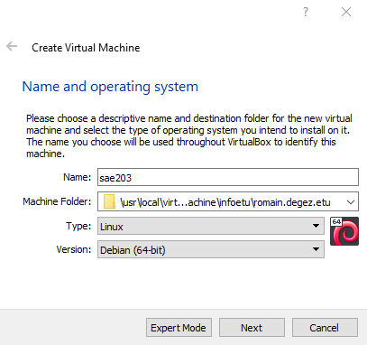
****

.Deuxième étape
****
Puis les différentes autres caractéristiquent à configurer :

--
* La RAM (2048 Mo) : 
--

.Caractéristique 2
[#img-caracteristique2,caption="Figure 2: "]
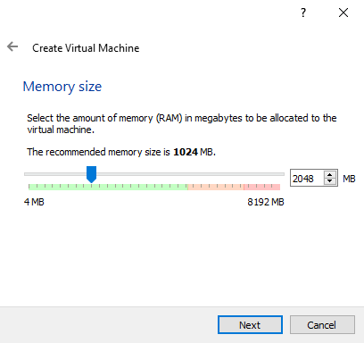

***

--
* Le type de fichier (VMDK) :
--

.Caractéristique 3
[#img-caracteristique3,caption="Figure 3: "]
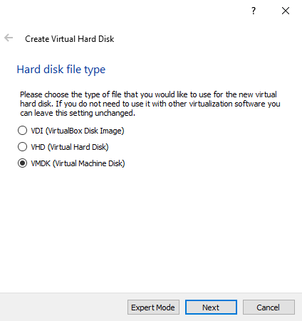

***

--
* La facon dont le stockage de données est géré (taile fixe) :
--

.Caractéristique 4
[#img-caracteristique4,caption="Figure 4: "]
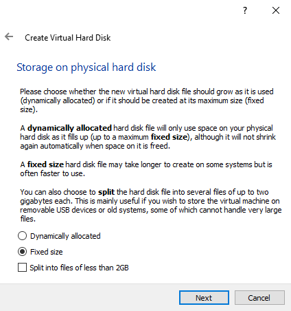

***

--
* La taille du disque dur virtuelle de la machine (20 GO) :
--

.Caractéristique 5
[#img-caracteristique5,caption="Figure 5: "]
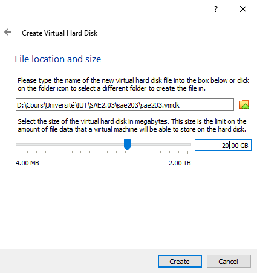
****

#Et voilà notre machine virtuelle neuve.#
====

=== 2. Installation de l'OS

====

.Première étape
****
Afin de faire cette installation il faut utiliser dans le lecteur cdrom de la machine nouvellement créée une iso bootable d'une installation de "Debian 11" (amd64) que l'on trouve https://www.debian.org/distrib/[*ici*]. 

.Choisir la bonne iso sur le site Debian
[#img-caracteristique6,caption="Figure 6: "]
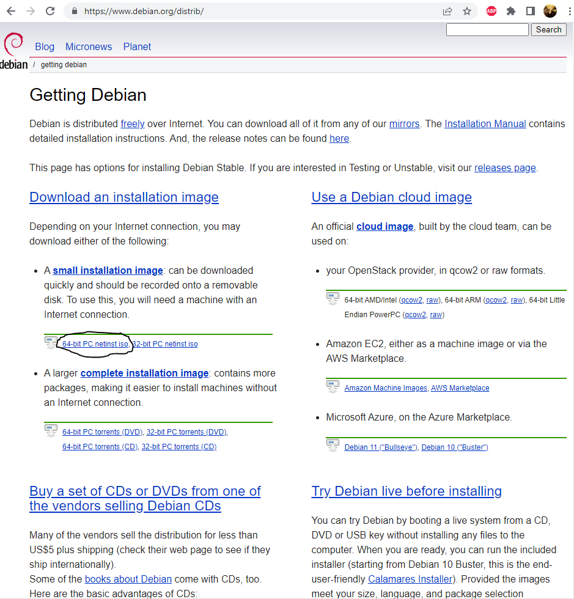
****

.Deuxième étape
****
Dans la partie stockage nous cliquons sur #l'icone de cd# là où est écrit `vide` (empty), puis apparait dans la partie de droite une autre icone de disque sur laquelle on appuie afin de choisir le fichier de disque que l'on veut.

.Accès au cdrom de notre machine
[#img-caracteristique7,caption="Figure 7: "]
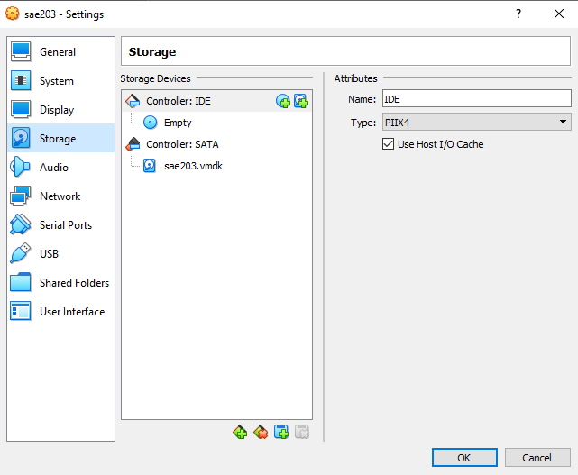

.Notre iso insérée
[#img-caracteristique8,caption="Figure 8: "]
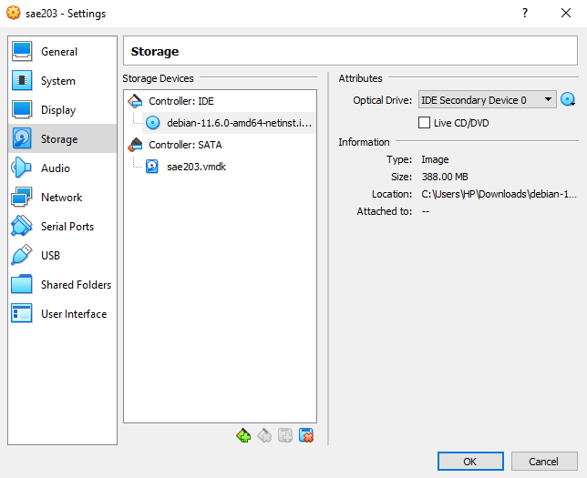
****

.Troisième étape
****
Après cette étape nous #démarrons# notre machine pour lancer l'instalation de l'OS.

.Démarage de la machine
[#img-caracteristique9,caption="Figure 9: "]
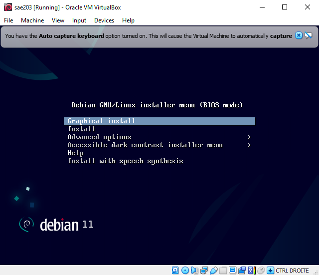
****

****
* Tout d'abord on #choisit la langue du système#, notre situation géographique ainsi que la configuration de notre clavier (ici Français puis France puis ,de nouveaux, Français).

.Choix de la langue du sytème
[#img-caracteristique10,caption="Figure 10: "]
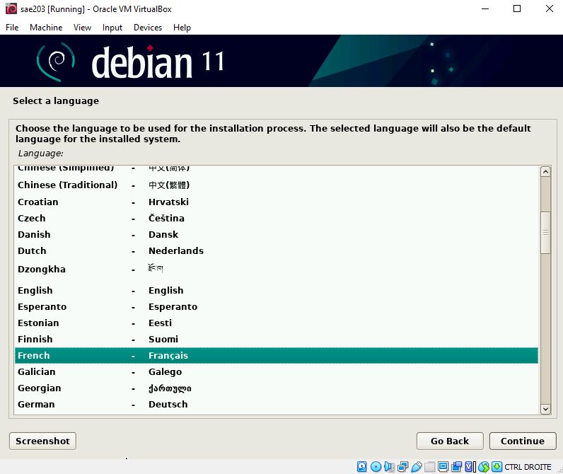

***

.Choix de la configuration clavier
[#img-caracteristique11,caption="Figure 11: "]
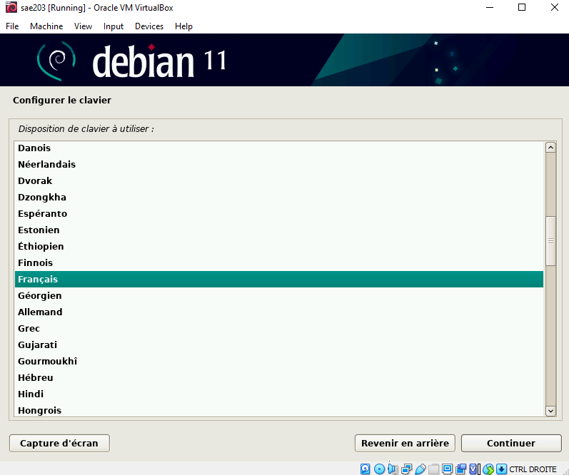
****

****
* Nous choisissons #un nom pour la machine# (serveur) et #ne mettons pas# de nom de domaine.
****

****
* Il faut ensuite définir un mot de passe pour le #superutilisateur# root (le plus souvent, le mot de passe est initialisé à "root") et c'est ce que l'on a choisit.

.Choix du mot de passe superutilisateur
[#img-caracteristique12,caption="Figure 12: "]
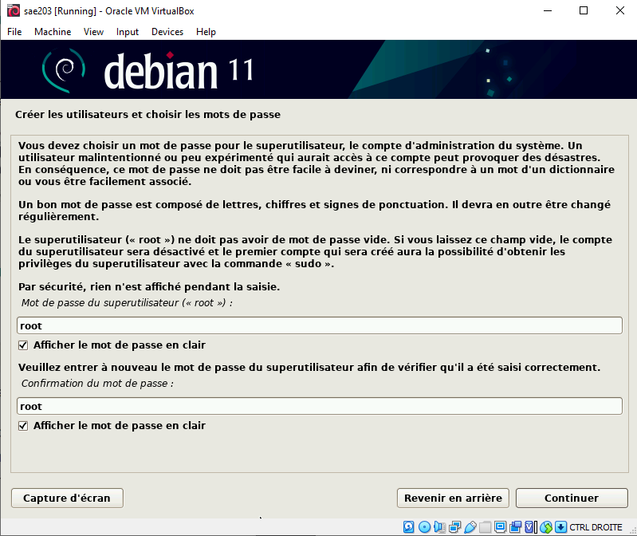
****

****
* Nous définissons ensuite un #utilisateur# avec son nom complet (User) son identifiant (user) et son mot de passe (user).

.Choix du mot de passe utilisateur
[#img-caracteristique13,caption="Figure 13: "]
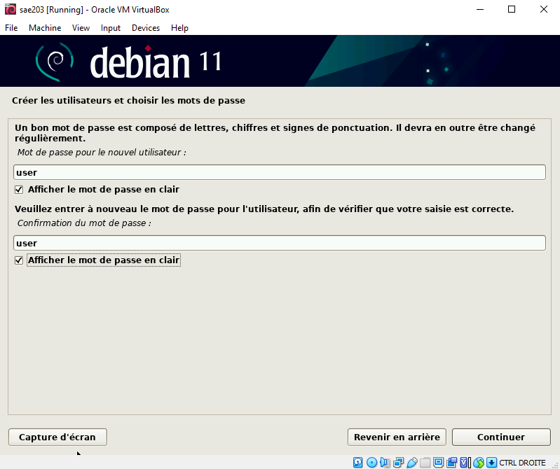
****

****
* La configuration du partionnement des disques est quelque peu délicate, il faut :
** Manuellement choisir de créer une partition
** Sélectionner le disque dur
** Cocher `oui`
** Selectionner l'espace libre
** Créer une nouvelle partition
** Laisser la taille maximale du disque
** Selectionner primaire
** Enfin il faut sélectionner pour le point de montage le système de fichier racine
****

****
* Terminer finalement le partitionnement :

.Choix de la partition manuellement
[#img-caracteristique14,caption="Figure 14: "]
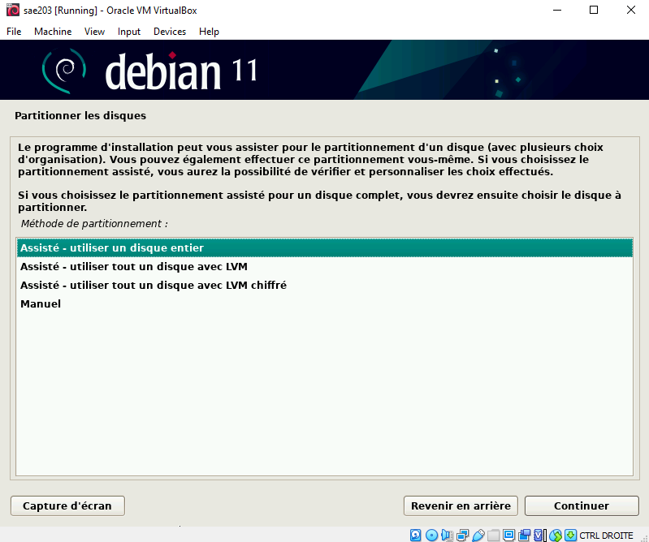

***

.Sélection du disque dur
[#img-caracteristique15,caption="Figure 15: "]
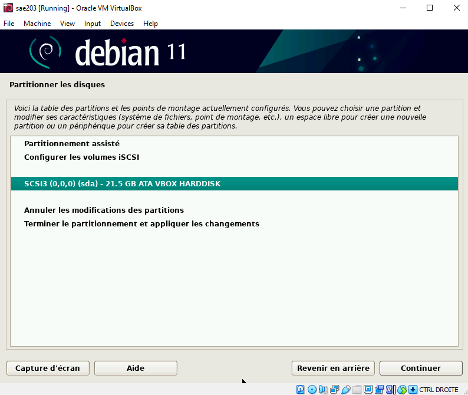

***

.Sélection de l'espace libre
[#img-caracteristique16,caption="Figure 16: "]
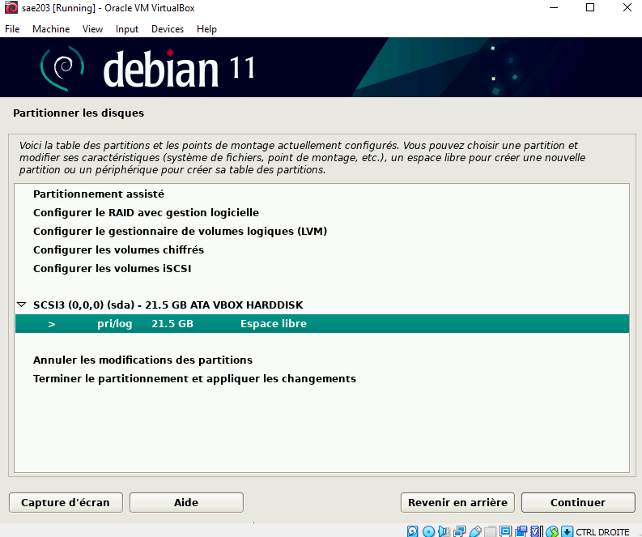

***

.Sélection du point de montage
[#img-caracteristique17,caption="Figure 17: "]
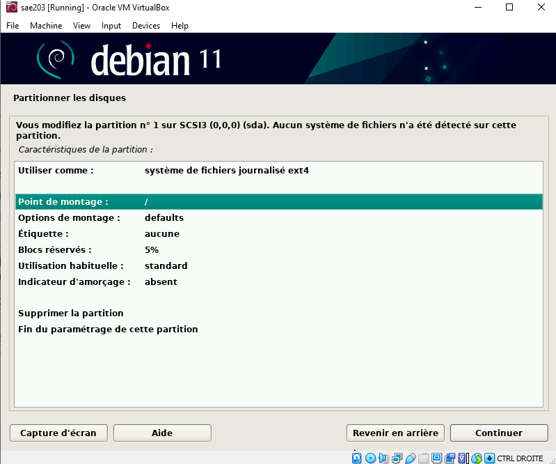

***

.Sélection pays du miroir
[#img-caracteristique18,caption="Figure 18: "]
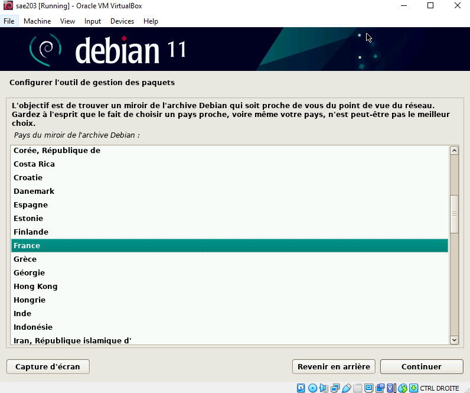
****

****
* Ici nous devons choisir un miroir d'ou proviendra les paquets, on prends le miroir `http://debian.polytech-lille.fr/` dans les miroirs se trouvant en France :

.Sélection du miroir
[#img-caracteristique19,caption="Figure 19: "]
image::images/19.PNG[caracteristique 19,500,300]
****

****
* Nous trouvant à l'IUT nous devons utiliser un proxy `http://cache.univ-lille.fr:3128/` qui ne serait pas nécessaire en effectuant l'installation chez nous :

.Renseignement du proxy
[#img-caracteristique20,caption="Figure 20: "]
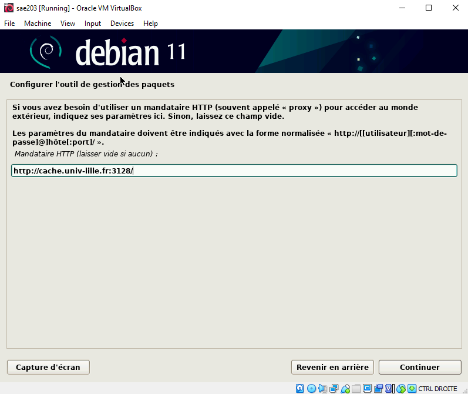
****

****
* Dans notre cas d'utilisation nous n'avons pas d'intérêt à activé l'envoi automatique des statistiques sur les paquets que nous utilisons.
****

****
* Notre sélection des logiciels de démarrage sont ceux cochées ci-dessous :
.Sélection des logiciels de démarrage
[#img-caracteristique21,caption="Figure 21: "]
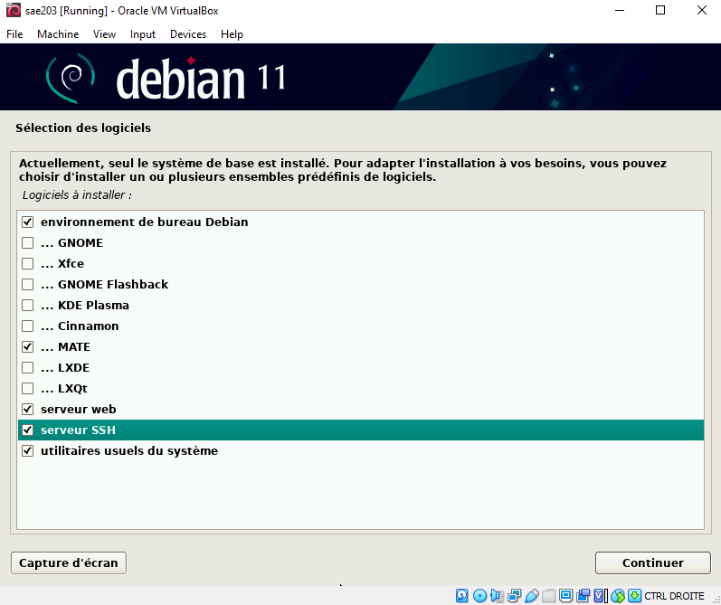
****

****
* Pour finir nous installons le système de démarage GRUB sur le seul disque que nous avons.
****

#Et voilà notre installation de l'OS terminer.#

****
TIP: _Nous faisons évidemment attention à bien retirer l'iso du cdrom avant de relancer notre machine après avoir achevé l'installation_ (ici le cdrom a été vidé automatiquement à la fin de l'installation).

.Cdrom vide
[#img-caracteristique22,caption="Figure 22: "]
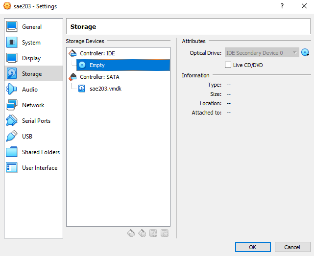
****
====

=== 3. Donner l'accès sudo à l'utilisateur

====
*Passons à la partie suivante.*

****
Ceci simplifie par la suite notre utilisation de la machine mais il est préférable au niveau sécuritaire de n'utiliser que le superutilisateur (root) qui sans l'accès à celui-ci restraint l'accès à la configuration de la machine.
****

[.underline]#Voici les étapes que nous devons effectuée afin de donner l'accès sudo à l'utilisateur :#

****
* Tout d'abord nous devons passer en mode console de la machine virtuelle, seulement un problème s'oppose à nous, si nous ouvrons la consôle elle s'ouvre sur la machine physique et non sur la machine virtuelle, nous devons donc, pour éviter cela, aller au niveau du menu en haut de Virtualbox dans `Entrées › Clavier` et selectionné : `Clavier virtuel`.

.Activation du clavier virtuel
[#img-caracteristique23,caption="Figure 23: "]
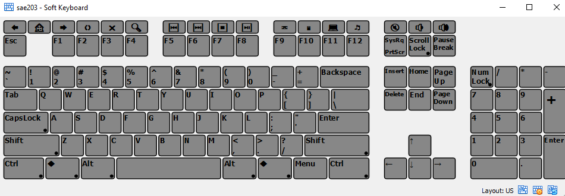
****

****
* Suite à cela, on utilise la combinaison de touches : kbd:[Ctrl+T+F1]  sur le clavier virtuel ce qui ouvre le terminal.

.Mode console
[#img-caracteristique24,caption="Figure 24: "]
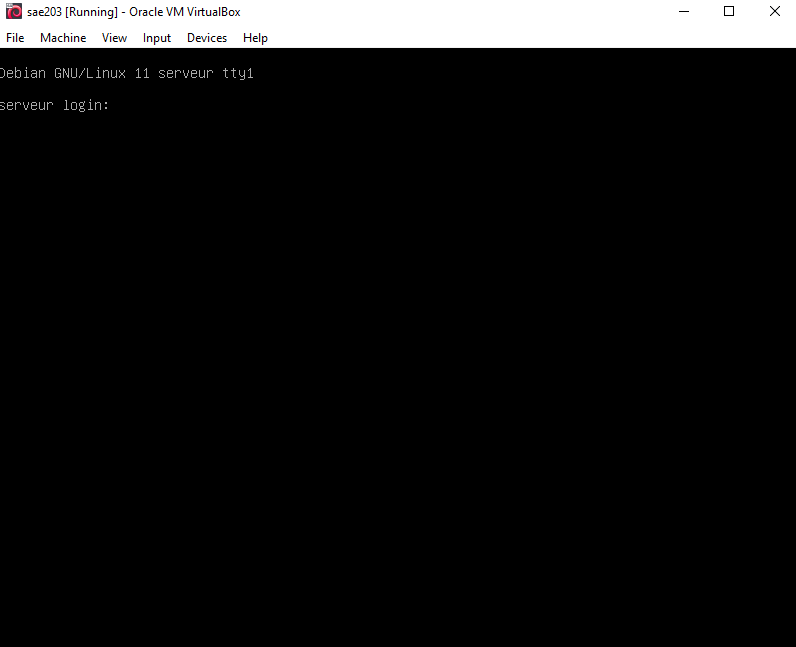
****

****
* #Nous nous connectons en root# grace à l'identifiant "root" et le mot de passe que l'on a initialisé dans l'étape :  *2. installation de l'OS*.
****

****
* Pour finir, on ajoute l'utilisateur au groupe sudo à l'aide de la commande :

[source,bash]
----
sudo adduser <NomUtilisateur> sudo
----

IMPORTANT: *A noter que les "<" et ">" présents dans les lignes de commande nous indiquent seulement que la partie entre guillemets est à modifié selon ce qui correspond sur notre machine*.
****

****
* Nous verifions que la modification a été effectuée avec la commande :

[source,bash]
----
groups <NomUtilisateur>
----
****

====

=== 4. Installer des suppléments invités

====

Dans cette partie nous avons ajouté des suppléments invités, pour ce faire :

****
* Nous sommes allé au niveau du menu en haut de Virtualbox dans `Périphériques › Insérer l’image CD des additions invités…` .
****

****
* Puis pour monter le cd, nous avons utilisé la commande :

[source,bash]
----
sudo mount /dev/cdrom /mnt
----
****

****
* Finalement pour installer les suppléments nous avons effectué la commande :

[source,bash]
----
sudo /mnt/VBoxLinuxAdditions.run
----

.Ligne de commandes entrées dans la console
[#img-caracteristique25,caption="Figure 25: "]
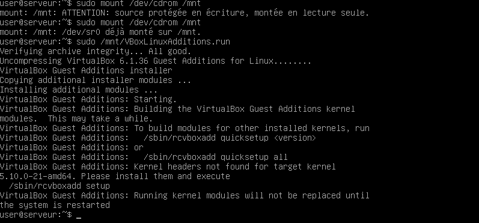
****

****
Après redémarrage de la machine et reconnexion nous pouvons constater le fonctionnement des suppléments après avoir mis la fenêtre en grand.
****
====

=== 5. Configurer le proxy
====
Normalement le proxy a déjà été configurer dans la partie *2. installation de l'OS*.
Mais si il nous venez à l'idée d'utiliser un autre proxy nous pouvons le configurer de deux manières : + 

.Première façon : changer le proxy dans le fichier de configuration.
****

Il nous faut d'abord accéder à ce fichier.
Pour cela il nous faut ouvrir un terminal, et utiliser la commande suivante :

[source,bash]
----
nano $HOME/.bashrc
----

Nous voila dans le fichier de configuration.
#On descend# maintenant tout en bas de ce fichier et on insert les lignes suivantes :

[source,bash]
----
export http_proxy=<ProxyQueVousVoulezUtiliser>
export https_proxy=$http_proxy
----

Il ne nous reste plus qu'à enregistrer et à quitter l'éditeur. Pour cela il faut utiliser la combinaison de touche suivante : +

* D'abord kbd:[Ctrl+O] puis `entrer` ce qui nous permet #d'enregistrer#. + 

* Et enfin kbd:[Ctrl+X] ce qui nous permet de #sortir# de l'éditeur.
****

.Deuxième façon : version graphique
****

On peut procéder directement en version "graphique". +
C'est à dire que l'on peut modifier le proxy via les paramètre direct. +
Pour cela il nous faut nous rendre dans : +
`Système › Préférences › Internet et réseau ›
Serveur mandataire`. +
De la nous avons juste à placer le même proxy dans la zone http et dans la zone http sécurisé.

Si toute fois nous voulons désactiver le proxy il nous suffi de cocher l’option `Connexion directe à Internet` au même endroit.
****
====

.FIN
****
**Et voila, notre machine virtuelle est configurée.**
****