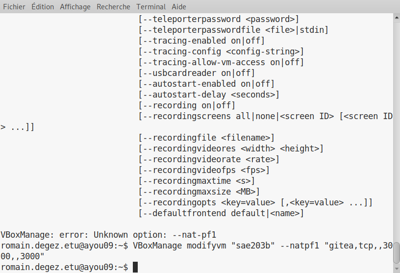

= Rapport n°3
Bertout Baptiste <author>; Degey Romain <author>; Lawson Killian <author>
:toc-title: Table des matières
:toc: left
:toclevels: 5
:icons: font
:experimental:

==  Semaine 10 et 11 : Gitea

=== Réponse aux questions : 

==== Question 1 

====

****
.Qu’est-ce que le logiciel git-gui ? Comment se lance-t-il ?
--
gti-gui est l’interface graphique d'un outil en ligne de commande (en somme un 
logiciel). De ce fait, toutes les possibilités offertes par Git ne sont pas disponibles 
dans Git Gui. Il est tout de même possible de procéder à des changements à leur 
dépôts en créant de nouveaux commits, les modifiants, créer de nouvelles branches, 
procéder à des fusions etc. +

Pour lancer Git gui, il y a plusieurs possibilités. Soit en ligne de commande: +

```bash
git gui
```

Soit, sous Windows via le menu démarrer ou le menu contextuel du clic droit dans un dossier.

Source : https://git-scm.com/docs/git-gui/[*git-scm.com*]
--
****

****
.Mêmes questions avec gitk
--
Gitk est un logiciel permettant l'affichage des changements dans un dépot ou une 
sélection de commits, en partie il affiche le graphe des commits, les informations à 
propos de chaque commit et les fichiers. +
Pour le lancer Gitk on tape en ligne de commande : +
```bash
gitk
```

Source : https://git-scm.com/docs/gitk[*git-scm.com*]
--
****

****
.Quelle sera la ligne de commande git pour utiliser par défaut le proxy de l’université sur tous vos projets git ?
--
```bash
git config --global http.proxy http://cache.univ-lille.fr:3128
```

Source : https://stackoverflow.com/questions/783811/getting-git-to-work-with-a-proxy-server-fails-with-request-timed-out[*stackoverflow.com*]
--
****
====

==== Question 2

====

****
.Qu’est-ce que Gitea ?
--
* Gitea est une forge logicielle libre en Go sous licence MIT, pour l'hébergement de développement logiciel, basé sur le logiciel de gestion de versions Git pour la gestion du code source, comportant un système de suivi des bugs, un wiki, ainsi que des outils pour la relecture de code. (Source : https://fr.wikipedia.org/wiki/Gitea[*wikipedia.org*])

* Gitea est un service Git auto-hébergé très simple à installer et à utiliser. Il est similaire à GitHub, Bitbucket ou Gitlab. (Source : https://docs.gitea.io/fr-fr/[*gitea.io*])

* Gitea est une forge logicielle web écrite en Go (Golang), il permet entre autres de fournir une interface web pour gérer vos différents dépôts (Source : https://nyleza.com/blog/decouverte-et-installation-gitea-gestionnaire-repo-git/[*nyleza.com*])
--
****

****
.À quels logiciels bien connus dans ce domaine peut-on le comparer ?
--
//TODO: répondre a la qestion
--
****
====

==== Question 3

====

****
.Comment faire pour la mettre à jour sans devoir tout reconfigurer ? Essayez en mettant à jour vers la version 1.19.
--
Vous pouvez mettre à jour vers une nouvelle version de Gitea en arrêtant Gitea, en remplaçant le binaire dans `/usr/local/bin/gitea` et en redémarrant l'instance. +

Le nom du fichier binaire ne doit pas être modifié pendant la mise à jour pour éviter des problèmes dans les référentiels existants. +

Il est recommandé de faire une https://docs.gitea.io/en-us/backup-and-restore/[*sauvegarde*] avant de mettre à jour votre installation.

IMPORTANT: Si vous avez effectué les étapes d'installation décrites ci-dessus, le binaire doit avoir le nom générique gitea. Ne le modifiez pas, comme pour inclure le numéro de version par exemple.
--
****
====

==== Question 4

====
****
.Que se passe-t-il ? Qu’elle semble en être la cause ?
--

--
****
====

=== Gitea

==== Préliminaire

=====  Configuration globale de git

====
****
Nous avons configurer quelques paramètres pour le logiciel git sur votre compte utilisateur.

Pour ce faire nous avons, dans un terminal, entré ces commandes : 

* `git config --global user.name "Romain Degez"`

* `git config --global user.email "romain.degez.etu@univ-lille.fr"`

* `git config --global init.defaultBranch "master"`

.Configuration globale de git
[#img-configuration,caption="Figure 32: "]

****

****
Afin d’installer le paquet git-gui nous utilissons la commande :
```bash
sudo apt-get install git-gui
```

.Installation du paquet
[#img-installation_paquet,caption="Figure 33: "]
image::images/33.png[Installation du paquet,650,450]

.Configuration globale de git
[#img-installation_paquet_2,caption="Figure 34: "]
image::images/34.png[Configuration globale de git,650,450]
****
====

=====  Accéder au port 3000

====
****
Nous avons besoin de rediriger le port 3000 de la machine physique, pour ce faire on peut entrer une commande dans le terminal ou bien le faire via l’interface graphique de virtualbox  :
****

.Ajouter en ligne de commande
****
```bash
VBoxManage modifyvm "sae203b" --natpf1 "gitea,tcp,,3000,,3000"
```

.Redirection du port 3000
[#img-vboxmanage,caption="Figure 37: "]


****

.Ajouter via interface
****
* Nous sommes allé dans configuration de la machine sae203b
* Puis dans réseau
* Puis nous avons cliqué sur `redirection de ports`
* Puis nous l'avons ajouté comme sur l’image

Source : https://www.virtualbox.org/manual/UserManual.html#natforward[*virtualbox.org*]
****
====

==== Installation de Gitea

===== Installation du binaire

====
****
Tout d’abord nous avons définit par défaut le proxy de l'université dans notre bash, pour ce faire nous ajoutons dans le `.bashrc` les lignes suivantes à la fois connecté en root et à la fois en user : +

```bash
export http_proxy=http://cache.univ-lille.fr:3128
export https_proxy=http://cache.univ-lille.fr:3128
```

.export
[#img-export,caption="Figure 38: "]
image::images/40.png[Modification du fichier .bashrc,650,450]

Apèes avoir fait ça, on redémarre la machine pour appliquer le proxy par défaut

****

****
Il n’y a pas de paquets debian disponible pour le logiciel gitea, donc il faut pour cela l’installer d’une façon différente. +
Nous avons pour cela fait une installation du binaire dont la démarche est expliqué link:https://docs.gitea.io/en-us/install-from-binary/[*ici*] : 

* Tout d’abord nous allons télécharger Gitea via le ficher “gitea-1.18.5-linux-amd64” se trouvant dans le dossier de la version 1.18.5 du binaire précompilé (pour linux donc linux-amd64). 

.1.18.5
[#img-gitea_1_18_5,caption="Figure 39: "]
image::images/38.png[Recherche du fichier Gitea,650,450]

***

.1.18.5_bis
[#img-gitea_1_18_5_bis,caption="Figure 40: "]
image::images/39.png[Recherche du fichier Gitea,650,450]

* Pour le faire simplememnt, nous avons utiliser les commande : +
```bash
wget -O gitea https://dl.gitea.com/gitea/1.18.5/gitea-1.18.5-linux-amd64
chmod +x gitea
```

.wget
[#img-wget,caption="Figure 41: "]


* Il faut ensuite valider le binaire téléchargé utilisant la clé correspondante (gitea-1.18.5-linux-amd64.asc) via les commande : +
```bash
gpg --keyserver keys.openpgp.org --recv 7C9E68152594688862D62AF62D9AE806EC1592E2
gpg --verify gitea-1.18.5-linux-amd64.asc gitea-1.18.5-linux-amd64
```

.gpg
[#img-gpg,caption="Figure 42: "]
image::images/42.png[Validation du binaire,650,450] 

IMPORTANT: La vérification n'a pas fonctionnée à cause du serveur qui est down, on peut voir que la commande moulline sans que rien ne se passe, donc on a passé la vérification.

* On vérifie ensuite la version de git, celle ci doit être supérieur à 2.0 : +
```bash
git  - - version
```
Ce qui affiche : git version 2.30.2

* On crée ensuite un utilisateur pour lancer Gitea : +
```bash
adduser \
   --system \
   --shell /bin/bash \
   --gecos 'Git Version Control' \
   --group \
   --disabled-password \
   --home /home/git \
   git
```

.adduser
[#img-adduser,caption="Figure 43: "]


* On crée l'arborescence utile pour Gitea avec un ensemble de commande : +
```bash
mkdir -p /var/lib/gitea/{custom,data,log}
chown -R git:git /var/lib/gitea/
chmod -R 750 /var/lib/gitea/
mkdir /etc/gitea
chown root:git /etc/gitea
chmod 770 /etc/gitea
```

NOTE: On donne des droits d’écriture temporaire pour l’utilisateur git sur le fichier `/etc/gitea`. 

Après l'installation, il vaut mieux remettre les permissions de ce fichier en lecture seulement : +
```bash
chmod 750 /etc/gitea
chmod 640 /etc/gitea/app.ini
```

IMPORTANT: Nous avons un problème ici, impossible d’avoir accès au fichiers `app.ini`. Il n’est pas trouvable sur la machine.

* On configure l’espace de travail Gitea : +

NOTE: Si on avait envisagé de ne pas exécuter Gitea en tant que service Linux, on aurait dû exécuter cette commande pour définir cette variable d'environnement de manière (semi-)permanente afin que Gitea utilise systématiquement le bon répertoire de travail : `export GITEA_WORK_DIR=/var/lib/gitea/`

* On copie le binaire de Gitea dans un emplacement global : +
```bash
cp gitea /usr/local/bin/gitea
```

****
====

===== Démarrage automatique du service

====
****
On crée un fichier service pour l’automatisation du lancement de Gitea : +

* Pour ce faire nous utilisons la commande : +
```bash
nano /etc/systemd/system/gitea.service
```
qui nous permet de copier directement dans ce nouveau fichier.

* Nous y insérons l'ensemble du contenu de link:https://github.com/go-gitea/gitea/blob/main/contrib/systemd/gitea.service[*cette page*]

* Pour finir nous lançons gitea avec ces commandes : +
```bash
sudo systemctl enable gitea
sudo systemctl start gitea
```

****
====

===== Paramétrage de Gitea

====
****
Pour cette partie nous avons tout d’abord vérifié si la redirection du port 3000 fonctionne en utilisant la commande : 

```bash
systemctl status gitea.service
```

Cela nous affiche active (running) ce qui signifie que cela fonctionne bel et bien (voir image)
****

****
Ensuite nous paramétrons le service gitea via notre navigateur, pour ce faire nous nous rendons sur le navigateur de notre machine physique à cette url : http://localhost:3000/

.Paramétrage de gitea
[#img-configuration_gitea,caption="Figure 45: "]


Nous avons modifier le paramétrage de Gitea sur notre navigateur : +

* Nous changeons la base de données qui sera maintenant SQLite3
* Nous avons laissé tout le reste par défaut jusqu'à la partie “Paramètres facultatifs”
* Dans cette partie nous avons modifié la partie “Paramètre de compte administrateur” :
** le nom devient : gitea
** le mot de passe : gitea
** l’email devient : git@localhost

.Modification de gitea
[#img-modification_gitea,caption="Figure 46: "]
image::images/46.png[Modification de Gitea,650,450]
****

****
IMPORTANT: Lors de la validation du paramétrage de l'installation une erreur est survenue car nous n’avions plus l'accès à `/etc/gitea/app.ini`

.Erreur sur gitea
[#img-erreur_gitea,caption="Figure 47: "]
image::images/47.png[Erreur sur gitea,650,450]

Nous avons donc donné de nouveau l'accès : 

```bash
chmod 770 /etc/gitea
chmod 770 /etc/gitea/app.ini
```

Puis avons valider l’installation de gitea

Nous avons finalement protéger de nouveaux les fichiers `/etc/gitea` et `/etc/gitea/app.ini` avec les commandes : 

```bash
chmod 750 /etc/gitea
chmod 640 /etc/gitea/app.ini
```

****
====

==== Utilisation basique

====
****
Nous avons créé un dépot via l’interface gitea :

.Dépot sur gitea
[#img-depot_gitea,caption="Figure 48: "]


Nous avons eu un problème lors de l'initialisation du nom qui ne peut pas comporter d’espaces (voir image)

.Création d'un dépot gitea
[#img-nouveau_depot,caption="Figure 50: "]
image::images/50.png[Création d'un dépot gitea,650,450]

.Erreur à la création du dépot
[#img-erreur_depot,caption="Figure 51: "]


Le dépot est créé

.Dépot créé
[#img-depot_crée,caption="Figure 52: "]
image::images/52.png[Dépot créé,650,450]

***

.Migration des données
[#img-migration_données,caption="Figure 54: "]
image::images/54.png[Migration des données sur Gitea,650,450]

***

.Migrer depuis Gitlab
[#img-gitlab,caption="Figure 55: "]
image::images/55.png[Migration des données depuis Gitlab,650,450]

***

.Nouveau dépot pour dev-oo
[#img-depot_dev-oo,caption="Figure 56: "]
image::images/56.png[Nouveau dépot Gitea pour dev-oo,650,450]
****
====

==== Problème majeur de ce projet

====
Nous avons dù refaire la VM plein de fois, puis on a découvert cette commande nous permettant d’éviter cela et d'avoir accès à nos machine en dehors de nos salle de TP : 

Se connecter à la machine : 
```bash
ssh -X [login@] ayou09
```
====